# Multi-Agent Component Pipeline

A production-style multi-agent workflow built with Claude Code that automates the full lifecycle of frontend component development — from feature spec to merge-ready code.

This isn't a demo. It's the actual system I use to ship frontend components faster and with more consistency than a standard solo dev workflow.

---

## How It Works

The pipeline takes a feature spec or ticket as input and runs it through a sequence of specialized agents — each with a defined role, model tier, and read/write scope. The orchestrator coordinates everything, two user approval gates keep a human in the loop, and a re-plan loop handles issues before they surface in review.

## Pipeline Architecture

```mermaid
flowchart TD
    USER([👤 User: Feature Spec / Ticket])
    USER --> ORC

    ORC["🎯 ORCHESTRATOR\n(claude-haiku)\nCoordinates pipeline,\ncreates spec.md"]
    ORC --> PRE

    PRE{{"Pre-flight Validation\nConfirms: module, components,\ndata fetching, design constraints"}}
    PRE --> ANA

    ANA["🔍 COMPONENT ANALYST\n(claude-sonnet · read-only)\nDiscovers conventions, scans reusables,\nclassifies: REUSE / ADAPT / WRITE NEW\n→ writes analyst-report.md"]
    ANA --> GATE1

    GATE1{{"👤 User Approval Gate 1\nReview: classifications,\nhigh-risk ADAPTs, style conflicts"}}
    GATE1 --> IMP

    IMP["⚙️ COMPONENT IMPLEMENTATION\n(claude-sonnet · writes code)\nREUSE → import as-is\nADAPT → protective tests + minimal changes\nWRITE NEW → scaffold + implement\n\nIf 3+ components: runs parallel agents"]
    IMP --> LINT

    LINT{{"🔒 Lint / TS Hard Gate\neslint + tsc --noEmit\nAuto-fixes where possible\nBlocks on errors"}}
    LINT --> TEST

    TEST["🧪 COMPONENT TEST\n(claude-sonnet · writes tests)\nRuns existing tests, writes new tests\n80%+ coverage target · max 5 attempts/file\n→ writes test-report.md"]
    TEST --> REV

    REV["🔎 CODE REVIEWER\n(claude-opus · read-only)\nContract verification, correctness,\ntype safety, quality audit\n→ writes review-report.md\n→ Verdict: Ready / Needs Follow-up / Blocked"]
    REV --> LOOP

    LOOP{"P0/P1 Re-plan Loop\n✅ Ready or P2s only → Gate 2\n⚠️ P1s or 🚫 P0s → re-run\nMax 2 iterations then surface to user"}
    LOOP -->|"P0/P1 found\n(iteration < 2)"| IMP
    LOOP -->|"Ready or P2s only\nor max iterations hit"| GATE2

    GATE2{{"👤 User Approval Gate 2\nReview: merge readiness,\nremaining P2s, test coverage"}}
    GATE2 --> LESSONS

    LESSONS["📝 Lessons Capture\nOrchestrator scans all reports\nfor patterns → appends to lessons.md"]
    LESSONS --> DONE

    DONE([✅ Done])
```


---

## Agents

| Agent | Model | Role | Write Access |
|---|---|---|---|
| Orchestrator | claude-haiku | Coordinates pipeline, creates artifacts | Yes |
| Component Analyst | claude-sonnet | Discovers conventions, classifies components | No |
| Component Implementation | claude-sonnet | Writes and adapts components | Yes |
| Component Test | claude-sonnet | Writes and iterates on tests | Yes |
| Code Reviewer | claude-opus | Full audit, issues verdict | No |

---

## Design Decisions

**Model tiers are intentional.** Haiku runs the orchestrator — it's fast and cheap for coordination tasks that don't need deep reasoning. Sonnet handles the heavy lifting (analysis, implementation, testing). Opus is reserved for the final review pass where quality judgment matters most.

**Read-only agents prevent scope creep.** The analyst and reviewer can't write code. This keeps their output objective and prevents them from silently "fixing" things that should be flagged instead.

**Parallel execution for independent components.** When 3 or more components have no dependencies on each other, the implementation agent spawns parallel sub-agents per group. This keeps the pipeline fast on larger feature specs.

**The re-plan loop has a hard cap.** P0/P1 issues trigger a scoped re-run of implementation, lint, test, and review — but only twice. After that, unresolved issues are surfaced to the user rather than looping indefinitely. Keeps the pipeline from spinning.

**Lessons are captured automatically.** After every run the orchestrator scans all reports for recurring patterns and appends them to `lessons.md`. The pipeline gets smarter over time without manual retros.

---

## Repo Structure
```
├── orchestrator.md           # Orchestrator agent prompt
├── component-analyst.md      # Analyst agent prompt
├── component-implementation.md  # Implementation agent prompt
├── component-test.md         # Test agent prompt
├── code-reviewer.md          # Reviewer agent prompt
├── CLAUDE.md                 # Claude Code project config
├── skills/                   # Preloaded skill docs for agents
├── refs/                     # Reference patterns and conventions
└── ignore/                   # Files excluded from agent context
```

---

## Stack

Claude Code · claude-haiku · claude-sonnet · claude-opus · TypeScript · React · ESLint · Jest
