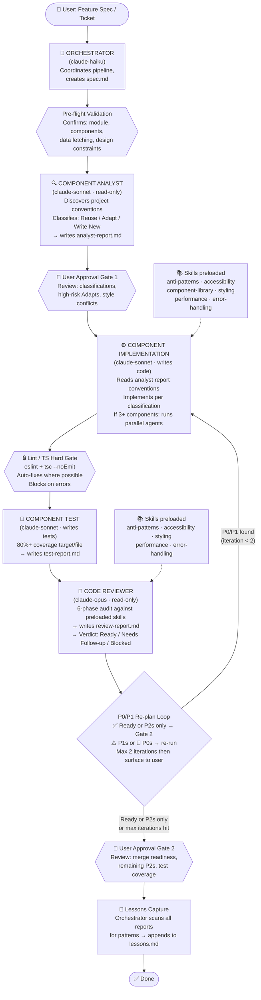

# Multi-Agent Component Pipeline

A multi-agent workflow built with Claude Code that automates the full lifecycle of frontend component development — from feature spec to merge-ready code.

---

## How It Works

The pipeline takes a feature spec or ticket as input and runs it through a sequence of specialized agents — each with a defined role, model tier, and read/write scope. The orchestrator coordinates everything, two user approval gates keep a human in the loop, and a re-plan loop handles issues before they surface in review.

## Pipeline Architecture



---

## Agents

| Agent                                                   | Model         | Max Turns | Role                                                                                | Write Access |
| ------------------------------------------------------- | ------------- | --------- | ----------------------------------------------------------------------------------- | ------------ |
| [orchestrator](orchestrator.md)                         | claude-haiku  | —         | Coordinates pipeline, manages state, runs lint/TS gate                              | Yes          |
| [component-analyst](component-analyst.md)               | claude-sonnet | 15        | Discovers project conventions, classifies components as REUSE/ADAPT/WRITE NEW       | No           |
| [component-implementation](component-implementation.md) | claude-sonnet | 25        | Implements components per analyst report; runs parallel agents for independent work | Yes          |
| [component-test](component-test.md)                     | claude-sonnet | 30        | Writes tests to 80% coverage, iterates until green                                  | Yes          |
| [code-reviewer](code-reviewer.md)                       | claude-opus   | 15        | 6-phase audit; issues merge readiness verdict                                       | No           |
| [bug-fixer](bug-fixer.md)                               | claude-sonnet | 20        | Reproduces bugs, finds root cause, makes minimum fix                                | Yes          |
| [data-layer](data-layer.md)                             | claude-sonnet | 25        | Validates API response types, audits query config, tests transforms                 | Yes          |
| [data-viz-reviewer](data-viz-reviewer.md)               | claude-opus   | 15        | Audits chart correctness, performance, accessibility, responsiveness                | No           |
| [seo](seo.md)                                           | claude-sonnet | 30        | Audits and implements technical SEO, on-page SEO, structured data, and GEO/AEO signals | Yes          |

---

## Skills

Preloaded into agents at startup — Claude has access to all rules without needing to fetch files at runtime.

| Skill                                                  | Preloaded Into                      | Description                                                                           |
| ------------------------------------------------------ | ----------------------------------- | ------------------------------------------------------------------------------------- |
| [anti-patterns](skills/anti-patterns/SKILL.md)         | implementation, reviewer, bug-fixer | React anti-pattern enforcement, self-review checklist, linting gates                  |
| [accessibility](skills/accessibility/SKILL.md)         | implementation, reviewer, data-viz-reviewer | WCAG 2.1 AA requirements: semantic HTML, keyboard nav, ARIA, forms                    |
| [component-library](skills/component-library/SKILL.md) | implementation                      | Radix UI usage, project wrapper lookup, responsive breakpoint guidance                |
| [styling](skills/styling/SKILL.md)                     | implementation, reviewer            | Design token config, className merging utility, cross-module style compatibility      |
| [performance](skills/performance/SKILL.md)             | implementation, reviewer, data-viz-reviewer | Memoization (when to and when not to), virtualization, code splitting, bundle impact  |
| [error-handling](skills/error-handling/SKILL.md)       | implementation, reviewer, bug-fixer | Three-states rule, error boundaries, fetch patterns, retry logic, logging conventions |
| [git](skills/git/SKILL.md)                             | — (user-invocable: `/git`)          | Injects staged diff + recent log, writes a commit message matching project style      |

---

## Refs

Reference documents agents load on-demand for detailed guidance.

| Ref                              | Used By                  | Description                                                                             |
| -------------------------------- | ------------------------ | --------------------------------------------------------------------------------------- |
| [typescript](refs/typescript.md) | implementation, reviewer | TypeScript strict mode rules, type conventions, discriminated unions, exhaustive checks |

---

## Design Decisions

**Model tiers are intentional.** Haiku runs the orchestrator - it's fast and cheap for coordination tasks that don't need deep reasoning. Sonnet handles the heavy lifting (analysis, implementation, testing). Opus is reserved for the final review pass where quality judgment matters most.

**The analyst owns convention discovery.** The analyst produces a Project Conventions table (export style, className utility, data fetching pattern, test runner, etc.) with evidence citations. Every downstream agent reads this table rather than rediscovering conventions independently.

**Read-only agents prevent scope creep.** The analyst and reviewer can't write code. This keeps their output objective and prevents them from silently "fixing" things that should be flagged instead.

**Skills replace inline rules.** Detailed guidance lives in preloaded skill files rather than repeated across agent prompts. Agents stay concise; skills stay authoritative.

**Parallel execution for independent components.** When 3 or more components have no dependencies on each other, the implementation agent spawns parallel sub-agents per group. This keeps the pipeline fast on larger feature specs.

**The re-plan loop has a hard cap.** P0/P1 issues trigger a scoped re-run of implementation, lint, test, and review — but only twice. After that, unresolved issues are surfaced to the user rather than looping indefinitely.

**The bug-fixer is intentionally separate.** The implementation agent is wired for feature work — it scaffolds, classifies, and runs the full checklist. A bug fix needs the opposite: read first, minimum change, no refactoring. Keeping them separate prevents over-engineering simple fixes.

**Lessons are captured automatically.** After every run the orchestrator scans all reports for recurring patterns and appends them to `lessons.md`. The pipeline gets smarter over time without manual retros.

**Data-layer and data-viz agents are standalone.** They run independently of the component pipeline — invoke them directly when adding API hooks, modifying query config, or building visualizations. The data-layer agent writes (types, tests for transforms); the data-viz-reviewer is read-only (flags issues with a merge verdict, like the code-reviewer). Their scopes are explicitly non-overlapping: data-layer owns the fetch/transform contract, data-viz-reviewer owns the rendered chart.

**The SEO agent covers both search engines and AI answer engines.** It runs independently of the component pipeline and audits/implements technical SEO (Core Web Vitals, crawlability, sitemaps), on-page SEO (titles, meta, semantic HTML), structured data (JSON-LD), and Generative Engine Optimization signals (llms.txt, citation-ready content structure, authority markers). It writes meta tags, schema, and crawl directives but defers product decisions (keywords, copy, AI crawler policy) back to the user.

---

## Repo Structure

```
├── orchestrator.md              # Pipeline coordinator
├── component-analyst.md         # Convention discovery + component classification
├── component-implementation.md  # Component implementation
├── component-test.md            # Test writing + coverage
├── code-reviewer.md             # Code review + merge verdict
├── bug-fixer.md                 # Standalone bug diagnosis + fix
├── data-layer.md                # API type validation + query config audit
├── data-viz-reviewer.md         # Chart correctness + perf + a11y review
├── seo.md                       # Technical/on-page SEO + structured data + GEO/AEO
├── CLAUDE.md                    # Repo conventions for Claude Code
├── skills/
│   ├── anti-patterns/           # React anti-patterns + self-review checklist
│   ├── accessibility/           # WCAG 2.1 AA requirements
│   ├── component-library/       # Radix UI + responsive guidance
│   ├── styling/                 # Design tokens + className conventions
│   ├── performance/             # Memoization, virtualization, code splitting
│   └── error-handling/          # Error boundaries, fetch patterns, logging
├── refs/
│   └── typescript.md            # TypeScript strict mode conventions
└── ignore/                      # Scratch files excluded from agent context
```

---

## Stack

Claude Code · claude-haiku · claude-sonnet · claude-opus · TypeScript · React · ESLint · Jest / Vitest
